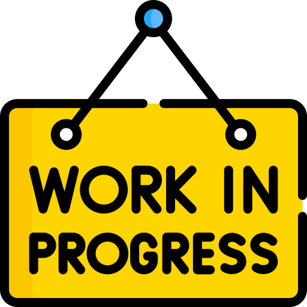
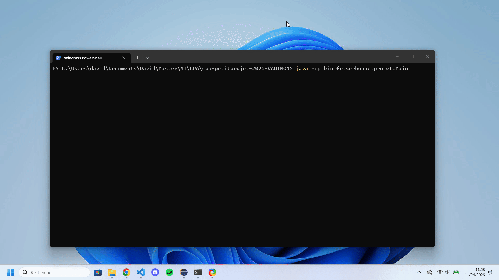
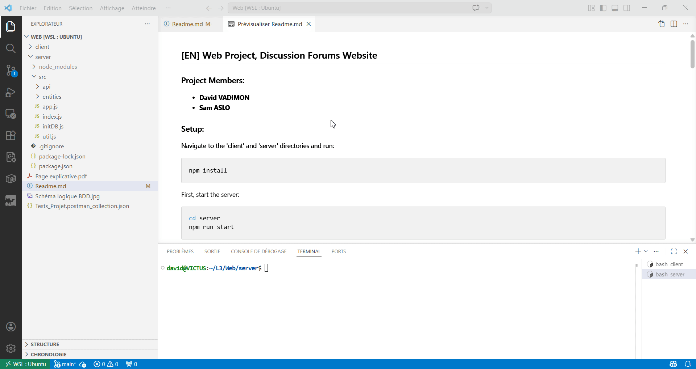
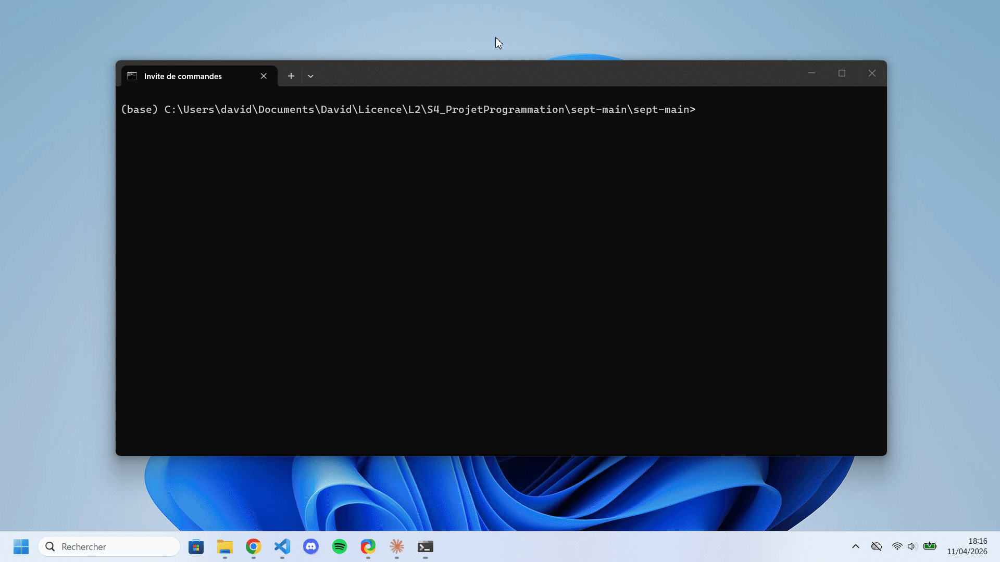
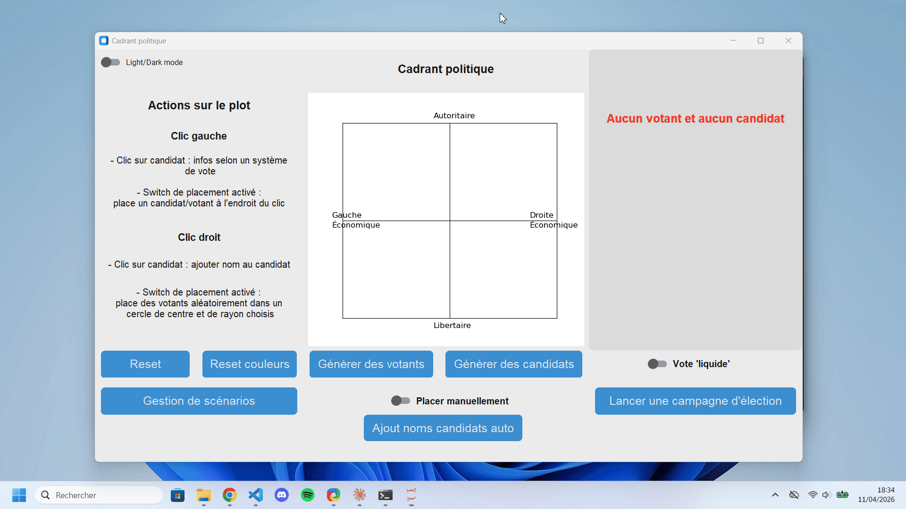
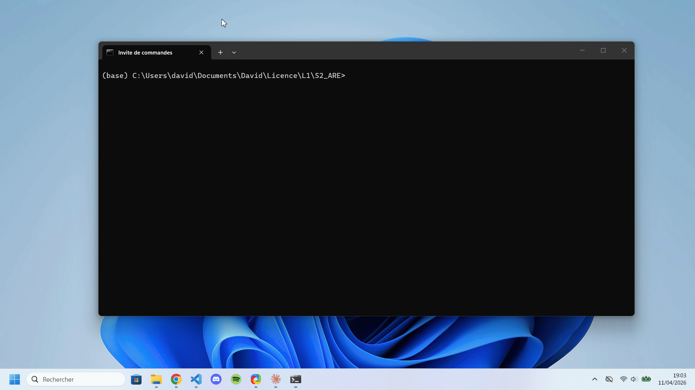

## Hi there 👋

My name is David, and I'm currently studying software engineering at Sorbonne University, France.

Here are some of my main projects done so far !

## First master year (2025-2026)

### ImageJ/Fiji lipid droplets characterization plugin

Plugin using existing ImageJ tools to allow completing a whole treatment pipeline on droplet images.

Technologies used:
- **Maven**
- **Java** (SciJava) + **Swing**
- **JUnit**
- **GitHub Actions**

Main features:
- Preprocessing, with contrast enhancement and/or median filter application on an image.
- Manual or automatic thresholding according to an existing method, producing a binary mask.
- Morphological operations on a binary mask.
- Particle analysis, with .csv and diagram exports.
- Different interactive tools to visualize and help at each workflow step.

### Welzl algorithm implementation

[GitHub repository](https://github.com/00David/Welzl-algorithm)

Implementation of Welzl algorithm, resolving the minimum enclosing circle problem for a finite given set of points.

Technologies used:
- **Java** + **Swing**

Main features:
- Naïve algorithm implementation.
- Welzl recursive implementation.
- Welzl iterative implementation.
- UI to visualize and compare execution times.

### Adaptive Huffman coding implementation

[GitHub repository](https://github.com/00David/Huffman-dynamique)

Implementation of Huffman coding, both for coding and decoding texts.

Technologies used :
- **Python**

Main features :
- Compression : from .txt to binary file.
- Decompression : from binary to .txt file.
- Statistics generated on each compression / decompression.

## Third bachelor year (2024-2025)

### Web application containerization

[GitHub repository](https://github.com/00David/DevOps_Project)

Containerization of a web application, with both frontend and backend provided.
The goal was to run the different components of the application in their own containers, and to provide easy usage.

Technologies used:
- **Docker** / **Docker Compose**
- **Kafka**
- **Strapi** (backend)
- **PostgreSQL** (Strapi database)

Main features:
- Through Strapi, running in container A, modify frontend content running in another container B.
- Launch containerized producers/consumers with Docker Compose, and make them communicate with the Strapi API.

See in the repository for a demonstration video (in french).

### Organiz’Asso – Web-Based Discussion Forum

[GitHub repository](https://github.com/00David/Web)

A web application offering to its users a place of peace and calm discussions !

Technologies used :
- **React** (frontend)
- **Javascript**, with **Express** (backend)
- **HTML** + **CSS**
- **MongoDB** (database)
- **Postman** (for tests)

Main features :
- Authentication & session management (Express sessions).
- Role-based access control (user/admin).
- Forum & messaging system (discussion threads + replies).
- Advanced message filtering (text, author, date).
- User profiles & profile management.
- Admin dashboard (user roles, registrations).
- Soft & hard deletion system (messages & accounts).

## Second bachelor year (2023-2024)

### Electoral simulation modeling

*(Code on a Sorbonne University GitLab private repository)*

A simulation of different electoral models, applied according to the political sensibilities of voters and candidates represented in a political spectrum quadrant.

Technologies used:
- **Python** + **customtkinter** (a ✨ fancier ✨ version of tkinter) + **mathplotlib** modules.

Main features:
- Implementation of different electoral rules.
- Implementation of the "liquid democracy" system applied to these rules.
- An interactive and dynamic UI, graphically explaining the results.
- Saving and loading of scenarios.
- An election campain mode : over X days, events influence the political positions of voters until the final election day. Some natural events are determined by the world’s characteristics, while others involving candidates have outcomes determined by the candidates’ characteristics.

## First bachelor year (2022-2023)

### Epidemic spread simulation modeling

[GitHub repository](https://github.com/are-dynamic-2023-g3/epidemie)

A simulation of an epidemic spreading, inspired by the SEIR model (S: Susceptible, E: Exposed, I: Infectious, R: Recovered). Each individual is represented as a case in a grid, and has one of the SEIR states.

Technologies used:
- **Python** + **tkinter** + **mathplotlib** modules.

Main features:
- Implementation of the SEIR model, with its associated parameters.
- Addition of a spatial dimension to the initial SEIR model, by placing individuals in a world (grid).
- Individuals can move, or have their movements restricted by lockdowns.
- A simulation mode : it provides more statistics and offers a direct comparison between the original SEIR model and our spatial implementation.

### A "Google translate" between Morse and French languages

[GitHub repository](https://github.com/00David/Morse-RasberryPi)

A local website directly kept on the Rasberry Pi offered to the user an experience close to "Google Translate", but with Morse and French languages.  

Technologies used:
- **Python** + **RPi** (Rasberry Pi management) + **flask** modules.
- **HTML** + **CSS** + **JavaScript**.
- **SQL**.

Main features:
- Translation between Morse and French:
    - For entering a Morse sequence as input, it had to be done using a button connected to the Raspberry Pi. There was NO OTHER WAY for the user to enter a Morse sequence (so no "-" or "." textually).
    - For outputting a Morse sequence, it was done by activating a red LED and/or a buzzer connected to the Raspberry Pi.
- Account management with history.
- Showable / hideable cheatsheets between Morse and French.
- Translation exercises.

Unfortunately, we did the project with a Raspberry Pi borrowed from the university, and I don't have one anymore, so there is no demonstration 💔.